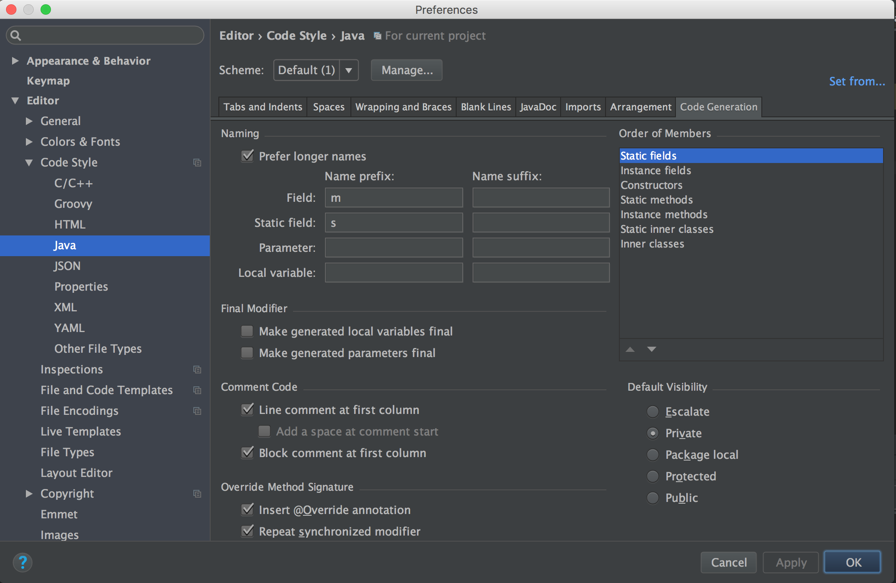
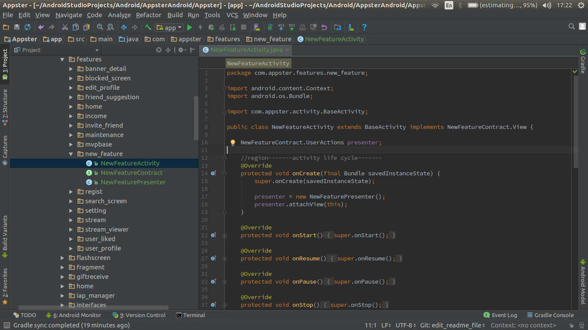

Master 

[](https://circleci.com/gh/AppsterDeveloper/Android/tree/master)

Develop

[](https://circleci.com/gh/AppsterDeveloper/Android/tree/develop)

# Android Team Code style

[**Follow Field Naming Conventions**](http://source.android.com/source/code-style.html#follow-field-naming-conventions)

* `Non-public, non-static` field names start with `m`
* `Static` field names start with `s`
* `Other fields` start with a `lower case` letter
* `Public static final` fields (constants) are `ALL_CAPS_WITH_UNDERSCORES`

For example:
```java
public class MyClass {
    public static final int SOME_CONSTANT = 42;
    public int publicField;
    private static MyClass sSingleton;
    int mPackagePrivate;
    private int mPrivate;
    protected int mProtected;
}
```

## Setup


## Using MVP Template
1. locate the template file at `{your_project_directory}/templates/BeliveMVPTemplate.zip`
2. unzip and copy the unzipped directory into `{your_Android_Studio_Path}/plugins/android/lib/templates/other/`directory
3. open or restart the Android Studio
4. in the Project Window in Android Studio, create a new package named `new_feature`
5. hit right mouse on the `new_feature` package, a new contextual menu shown, select `new -> other -> BeliveMVPTemplate`
6. done, as you can see in the screenshot below, Android Studio automatically creates for us 3 files `NewFeatureActivity` `NewFeatureContract` `NewFeaturePresenter` and they already implemented common methods as MVP pattern.


